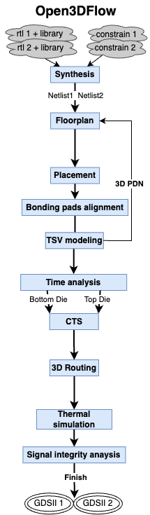
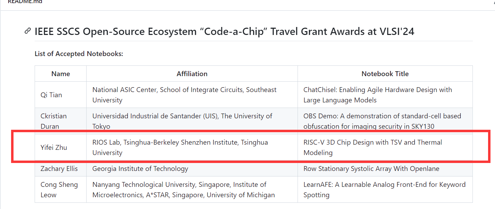
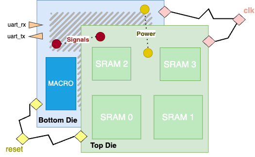
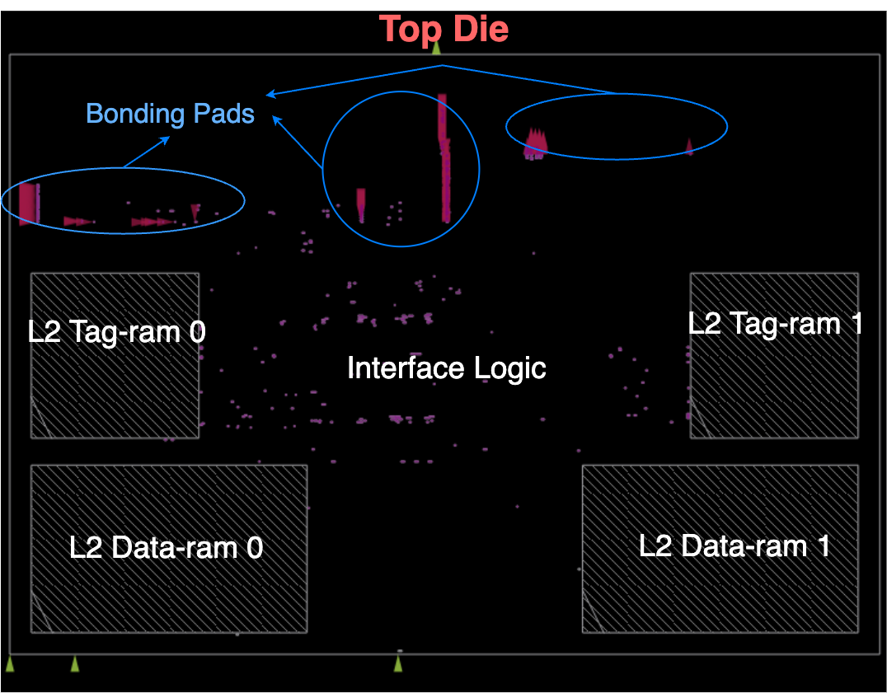
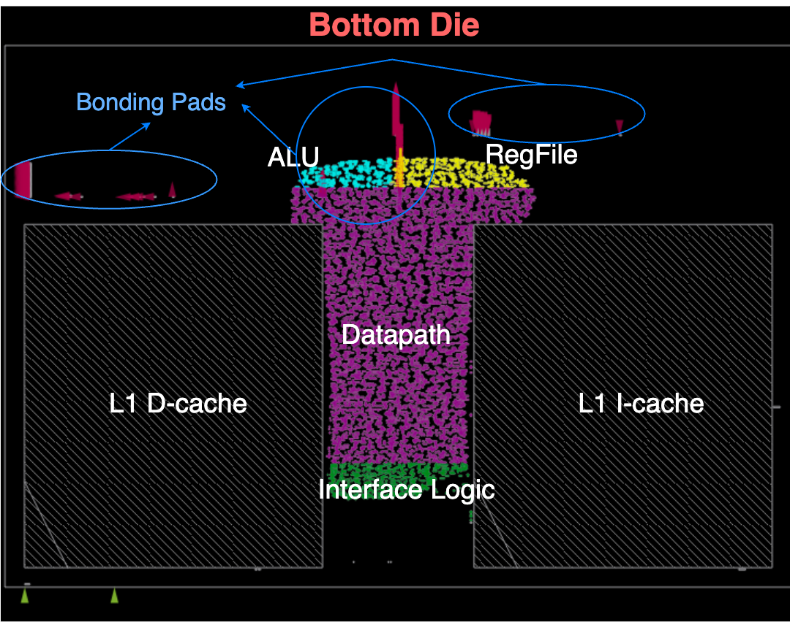
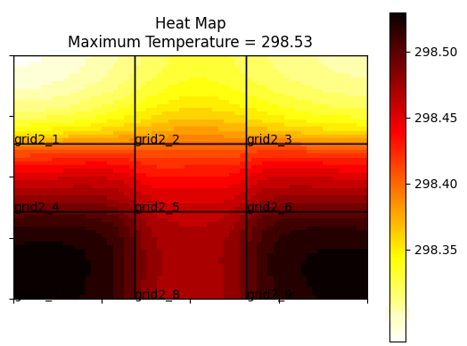
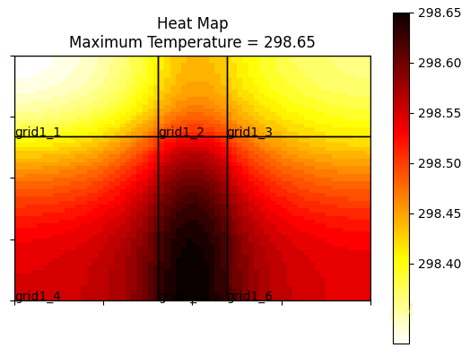
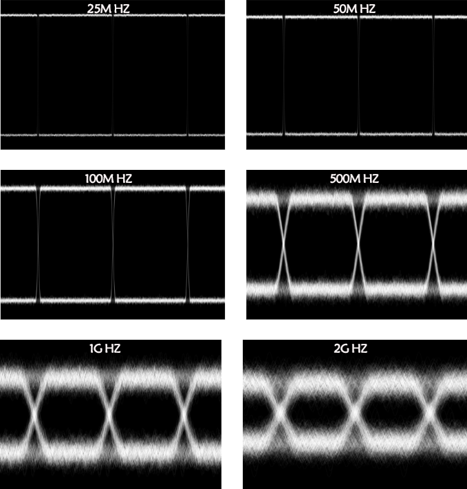

# Project Overview

This project endeavors to develop a 3D IC (Integrated Circuit) simulation framework leveraging the power of Open EDA (Electronic Design Automation) toolchains. Our goal is to provide a comprehensive solution for researchers and engineers to explore and evaluate the potential of 3D IC designs.

Open3DFlow now supports two-layer 3D IC, sky130A and gf180 processes. Its overall operation mode is shown in the following figure:

# Honorable Mention

This project has the distinction of being recognized in the VLSI24 "code-a-chip" competition (https://github.com/sscs-ose/sscs-ose-code-a-chip.github.io/tree/main/VLSI24). The award-winning entry, a fully functional Jupyter notebook, can be found at /doc/Open3DFlow.ipynb. This notebook serves as a valuable starting point and reference for understanding the capabilities and implementation of our 3D IC simulation approach.

# Open 3D IC Design Flow
Open3DFlow targets at realizing F2F-stacked 3D processors. It supports the hardening of a 3D CPU configured as the following figure, wherein the top tier functions as a cache die hosting SRAM macros, while the bottom tier incorporates the logical realization of the CPU and other hard macros. The two tiers are stacked F2F, sharing a synchronized clock and maintaining their own power grids. Bonding pads and TSVs transmit their signal and power.

Open3DFlow has referenced the operation flow of OpenRoad Flow Scripts (ORFS)\footnote{https://github.com/The-OpenROAD-Project/OpenROAD-flow-scripts}. In this work, we abstract certain existing steps within ORFS and augment them with additional modules tailored to our specific needs. The overall workflow of Open3DFlow contains 7 steps:

# Results Showcases
- Floorplan images of the 3D RISC-V processor in Open3DFlow:

- Temperature distribution maps with maximum temperatures
of 25.5°C and 25.38°C for the bottom top die respectively:

- Eye diagram of signals with frequency varying from 25MHz to 2GHz:

# Recent Advancements

Around June of this year, building upon the success of the award-winning work, I have undertaken significant enhancements to the design. 

But a selection of these improvements has been uploaded, offering an updated glimpse into the progress of the project. 

I sincerely apologize for not adhering to optimal naming conventions and organizing the code and files effectively during the development of Open3DFlow. I am currently engaged in the task of reorganizing my files, tidying up and categorizing the code, and aim to provide a comprehensive and user-friendly set of instructions and scripts that will facilitate reproduction of our work. While this may not be an overly complex task, it is indeed quite meticulous and time-consuming. Rest assured, I will continue to update the detailed instructions on the running process as I progress.

# Contribute and Collaborate

We welcome contributions from the community! Whether it's bug reports, feature requests, or even code contributions, your input is invaluable to the growth and success of this project. Feel free to open issues or submit pull requests on GitHub

# Author Information
Yifei Zhu, RIOS Lab, TsingHua University

Feel free to contact me through
 - WeChat: b224hislabcd
 - Mail: b224hisl@yandex.com ; zhuyf20@mails.tsinghua.edu.cn

【20250530】update
此项目为本人的博士课题，目前有非常多更新还没有传上来，因为其中涉及到和合作方代工厂的合作等，之后会一并脱敏上传。

