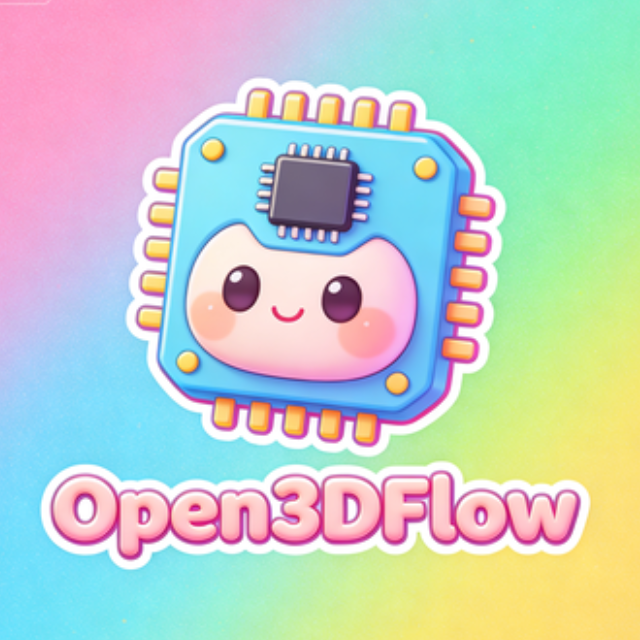

# Foreword
Thank you for your patience and continued interest in my project. Over the past two years, I have received many questions and messages from the community, and your enthusiasm has been truly encouraging.

Open3DFlow is currently involved in an active tape-out project in collaboration with a semiconductor foundry. Due to non-disclosure agreements (NDAs), certain details—such as chip parameters, models, and proprietary information from our partners—cannot be disclosed publicly at this time. To balance transparency with confidentiality, I am releasing a carefully anonymized yet functionally stable version that showcases the core capabilities of Open3DFlow.

More de-sensitized updates will follow as the project evolves. 

**This platform is my doctoral dissertation work, and it is maintained solely by myself. I appreciate your understanding and support.**

Thank you for being part of this journey.

## Author Information
Yifei Zhu, RIOS Lab, TsingHua University

Feel free to contact me through
 - Mail: b224hisl@yandex.com ; zhuyf20@mails.tsinghua.edu.cn

## Publication & Awards
The versions listed below are arranged in chronological order, representing the evolution of Open3DFlow. We have now released Open3DFlow 3.0, which marks its involvement in a real-world engineering project. This milestone serves as a strong endorsement for the platform, making it more solid and credible. However, this version is currently undergoing anonymization as it contains highly sensitive information from our manufacturing partner and cannot be open-sourced directly at this stage.


1. **The initial version**:
This project has the distinction of being recognized in the VLSI24 "code-a-chip" competition (https://github.com/sscs-ose/sscs-ose-code-a-chip.github.io/tree/main/VLSI24). The award-winning entry, a fully functional Jupyter notebook, can be found at /doc/Open3DFlow.ipynb. This notebook serves as a valuable starting point and reference for understanding the capabilities and implementation of our 3D IC simulation approach.
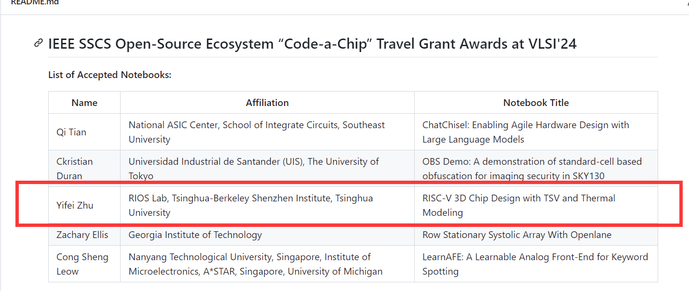

2. **Open3DFlow 1.0**:
The first official release of Open3DFlow, which demonstrates the integration of AI techniques to enhance 3D chip design workflows. The methodology and results are detailed in the following journal publication:
```
Y. Zhu, Z. Luan, D. Feng, et al., "Revolutionize 3D-Chip Design With Open3DFlow, an Open-Source AI-Enhanced Solution," IEEE Open Journal of Circuits and Systems (OJCAS), vol. 6, pp. 169–180, 2025.
```

3. **Open3DFlow 2.0**:
This version introduces significant enhancements, including comprehensive TSV characterization, improved compatibility with commercial PDKs, and seamless integration with proprietary EDA tools. The work was presented as an oral paper at the 2025 IEEE/ACM International Conference on Computer-Aided Design (ICCAD):
```
Y. Zhu, D. Feng, Z. Luan, et al., "Open3DFlow: An Open-Source EDA Platform for 3D Chip Design with AI Enhancement," in Proc. ICCAD, 2025, pp. 1–9.
```

4. **Open3DFlow 3.0**:
The latest release extends the platform with advanced packaging capabilities and has been deployed in a real-world FBGA 3D SiP engineering project. This version contains sensitive information from our manufacturing partner and is protected under a NDA. We are actively working on an anonymized release that will preserve the core functionality while removing confidential details.


# Project Overview
Open3DFlow is a fully open-source, end-to-end EDA platform tailored for 3D IC and heterogeneous advanced packaging design.

## Open3DFlow1.0 & 2.0: 3D Enable
### Target Chip Configuration
The platform is designed to enable the implementation of advanced 3D stacked chips. The primary target architecture is a face-to-face (F2F) stacked 3D RISC‑V processor with hybrid bonding and through‑silicon vias (TSVs).
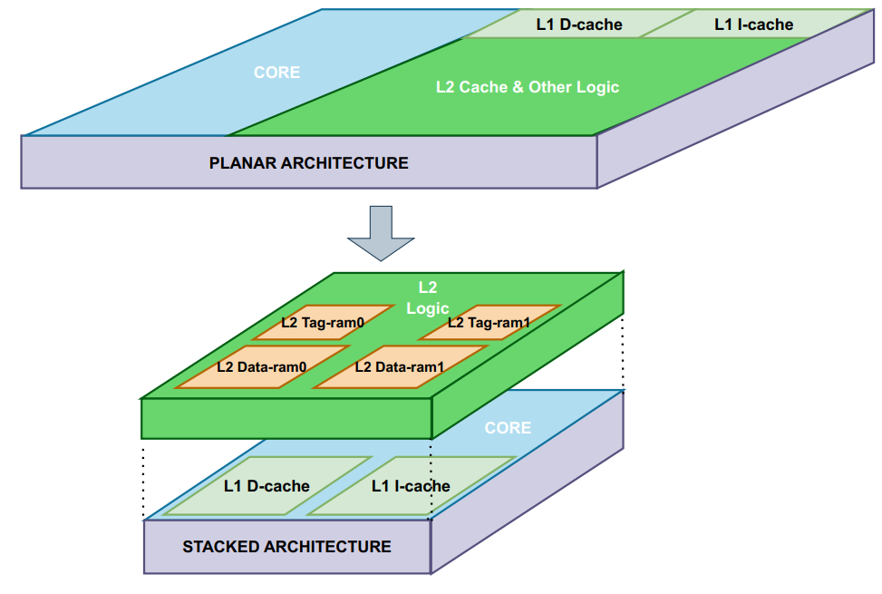
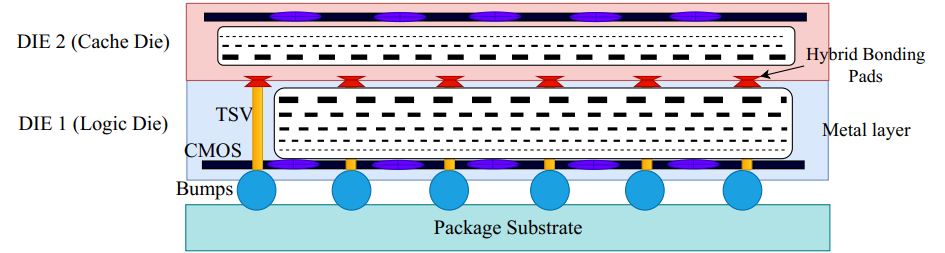
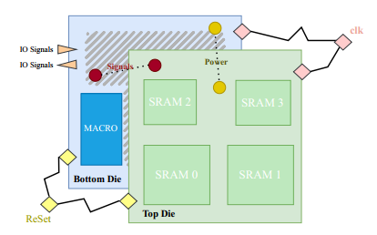

### Open3DFlow Execution Flow
The platform implements a seven‑stage workflow covering the entire RTL‑to‑GDSII design process for 3D ICs. Each stage is automated to ensure design correctness and manufacturability.

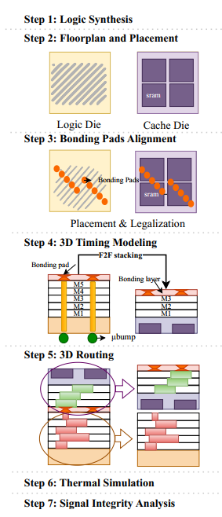

### Toolchain Integration
Open3DFlow seamlessly integrates self‑developed modules with established open‑source EDA tools, creating a unified design environment.

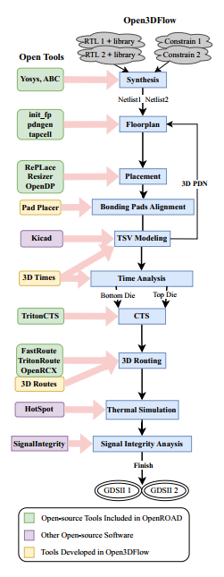

### Bonding Pad Implementation
The bonding layer is developed to enable manufacturable interfaces between heterogeneous process technologies. The pad settlement mechanism ensures alignment and routability across stacked dies.
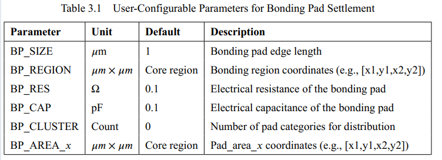
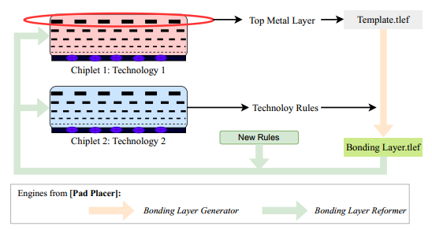
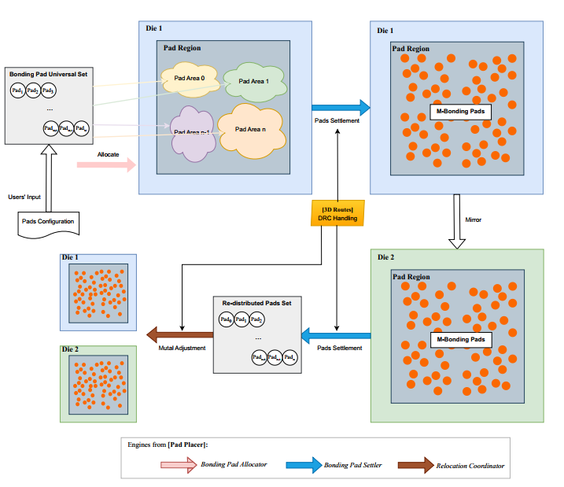

### TSV Insertion Mechanism
TSVs are inserted with configurable parameters, including dimensions, placement sites, and electrical characteristics. Dedicated placement sites and obstruction regions ensure DRC‑clean integration.
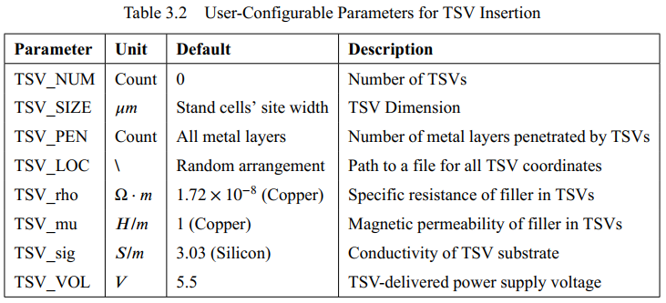
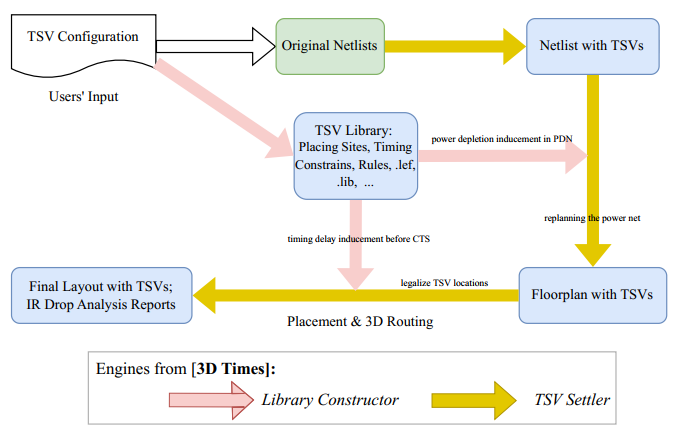

### Thermal Simulation
Open3DFlow interfaces with HotSpot to perform thermal analysis. Power maps are generated from layout data and benchmark activity, enabling temperature distribution simulation across the stacked dies.
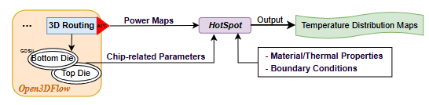
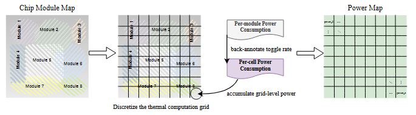

### Signal Integrity Simulation
Signal integrity analysis is performed by integrating with the SignalIntegrity library. Eye diagrams are generated to evaluate signal quality under various operating frequencies.

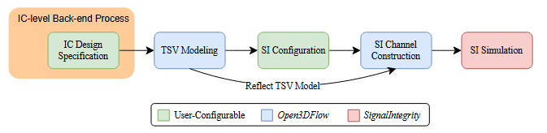

### Results Showcase
1. TSV Placement Sites

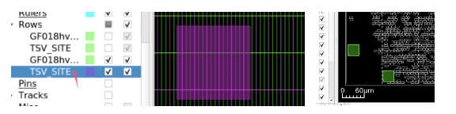
2. IR Drop Analysis with TSV Power Delivery

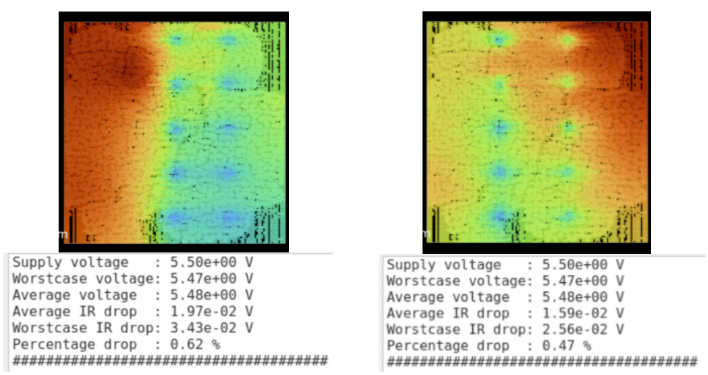
3. DRC‑Clean Top and Bottom Dies

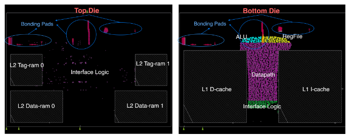
4. GF22 Compatibility Demonstration （For detailed workload and effort, please refer to the paper published in ICCAD. Due to proprietary restrictions, I'm unable to disclose content related to GF22）

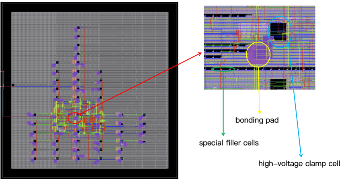

5. Thermal Simulation Results

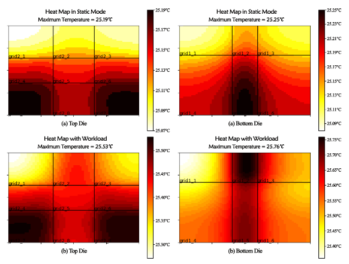

6. Signal Integrity Simulation Results

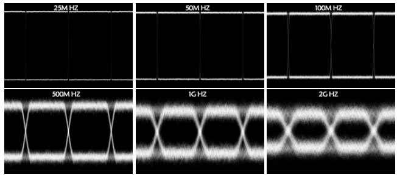

## Open3DFlow3.0: 3D SiP Project (ungoing)
Due to a NDA with our collaborating packaging vendor, certain project-specific details, models, and parameters cannot be publicly disclosed at this time.

Within this engineering project, Open3DFlow serves as a unified platform that integrates both simulation and physical implementation, bridging the gap between design exploration and tape-out readiness.

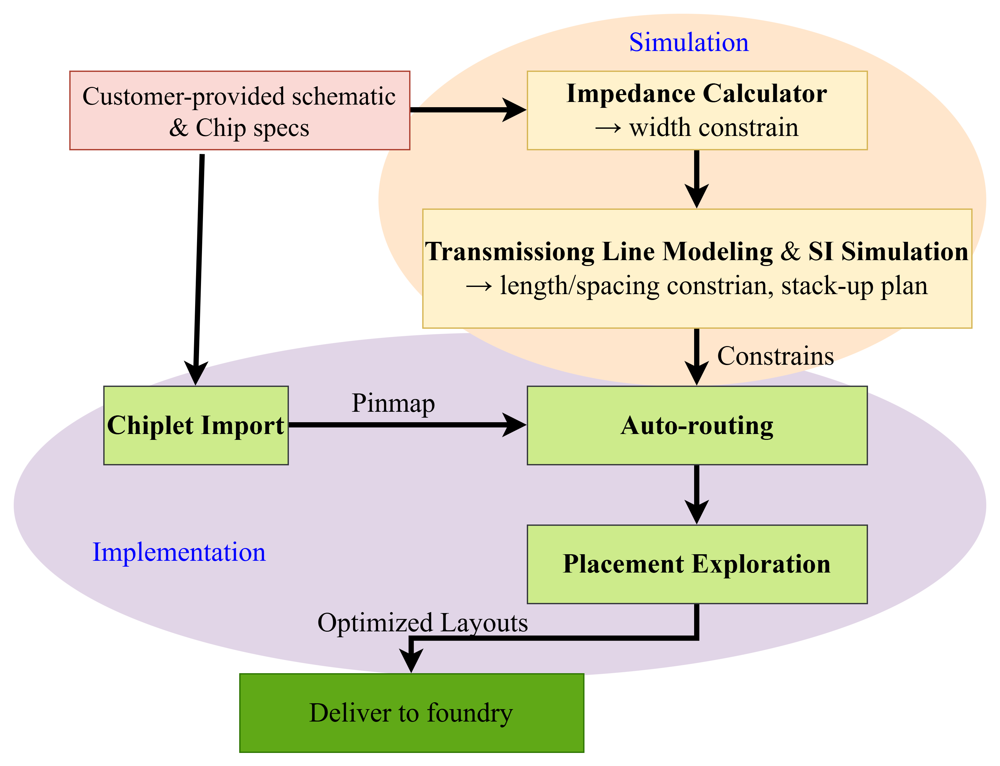

### Target Chip Configuration

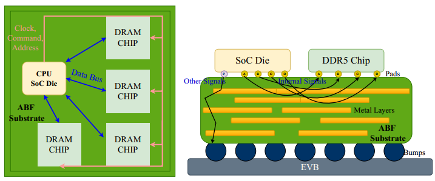

### Results Showcase
1. For Prerequisite Setup

    a) Impedance Matching

    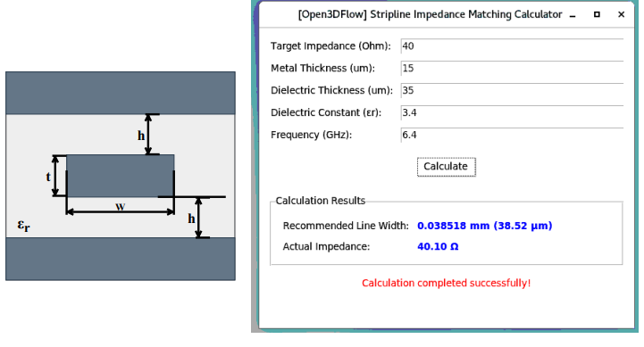

    b) Netlist import

2. SI simulation for crosstalk

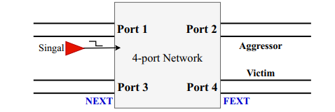

stack up:

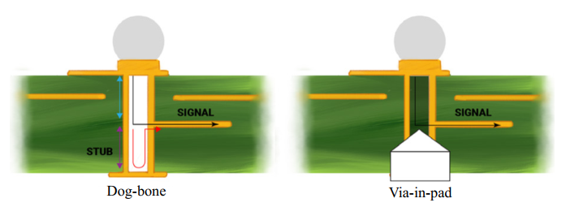

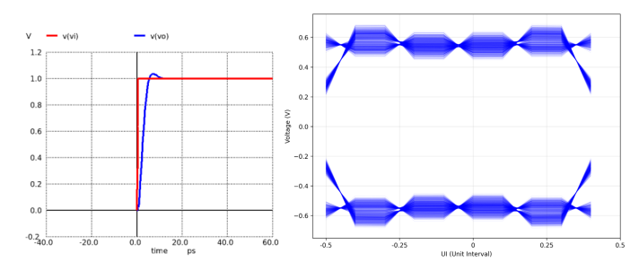

3. beef-up

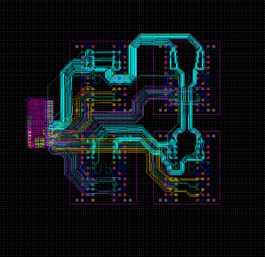
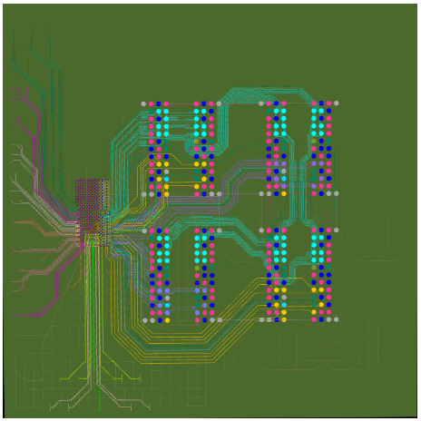

# Contribute and Collaborate
We welcome contributions from the community! Whether it's bug reports, feature requests, or even code contributions, your input is invaluable to the growth and success of this project. Feel free to open issues or submit pull requests on GitHub

# Some final remarks
I would like to express my sincere gratitude to **Tsinghua University**, and **RIOS Lab** and our packaging partners for their tremendous support of my project.

I am especially thankful to my advisor, **Professor Tan**, for his timely guidance and for providing the resources essential to this work.

The academic journey is indeed full of challenges. To all the students reading this: stay strong, stay positive, and may you complete your studies with joy!!!

If you ever face any difficulties, feel free to reach out to me. I really understand—because I’ve been through the rain myself—and I hope to hold an umbrella for you too. :)❤❤